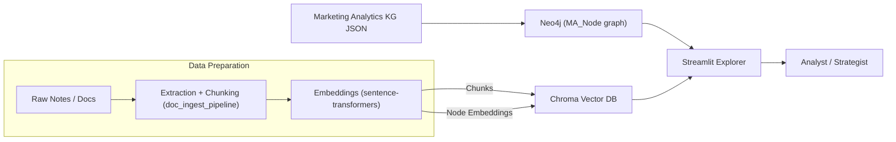
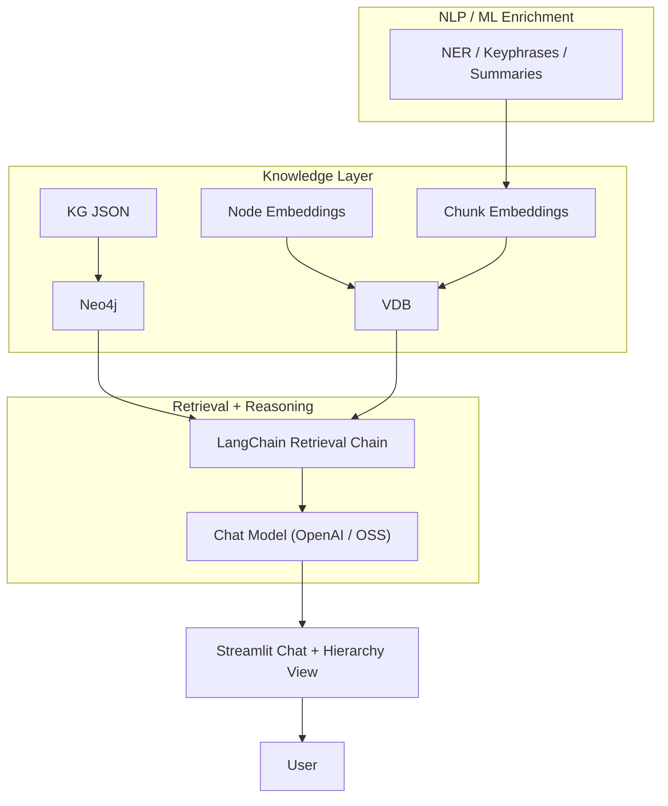

# Marketing Analytics KG + LLM Architecture

## 1. Current State (Dec 2025)

- **Data Preparation**
  - `notes/` corpus + proprietary docs → `scripts/doc_ingest_pipeline.py`.
  - Pipeline performs multi-format preprocessing, chunking, sentence-transformer embeddings, and spaCy-driven metadata (NER, keyphrases, summaries, learning-mode tags).

- **Vector Layer**
  - Chunk embeddings stored in Chroma (`artifacts/chroma/marketing-analytics-content`).
  - KG node embeddings saved in `artifacts/kg_node_embeddings.json`.

- **Structured Knowledge**
  - Hierarchical taxonomy defined in `artifacts/marketing_analytics_kg.json`.
  - Neo4j (Docker) hosts the graph (`MA_Node` + relationship types).

- **Experience Layer**
  - Streamlit explorer (`streamlit_app.py`) pulls subgraphs via `Neo4jService`, renders them with PyVis, and surfaces enriched Chroma chunks (summaries, learning/tone tags, entities).
  - Sidebar connection selector toggles between Local Docker and Neo4j Aura profiles (driven by `AppConfig`).
  - Learning blueprint panel reads `artifacts/learning_blueprints.json` to expose outcomes, activities, assessments, and coverage gaps per node.
  - LangChain-powered chat panel uses the `MarketingRAG` service (Chroma retriever + Neo4j facts) to answer questions with cited sources.
  - Sidebar controls: node picker, traversal depth, chunk query, topic filters.

## 2. Gaps vs. Requirements

| Requirement | Current Coverage | Missing Pieces |
|-------------|-----------------|----------------|
| Hierarchical / nested browsing | Graph viz + node metadata | Collapsible tree / sunburst view, side-by-side related-domain panels |
| LLM chat with RAG | Streamlit chat panel + LangChain RAG chain live | Conversation logging, evaluation harness, multi-model routing |
| NLP/ML enrichments | spaCy enrichment adds NER, keyphrases, summaries, learning tags | Sentiment scoring, model evaluation loop, advanced summarization |
| Deployment (Aura/Bloom) | Local Docker + Aura dual profile, runbooks in `docs/neo4j_aura.md` | Bloom palette export + remote admin hardening |
| Learning layer views | Blueprint generator + Streamlit panel fed by `learning_layer_builder.py` | Editable UI + progress dashboards, tie-ins to document coverage |
| Advanced ML (fine-tuning, RLHF) | Not started | Logging Q&A pairs, evaluation harness, fine-tune pipelines |

## 3. Upcoming Architecture (Proposed)

## 4. Suggested Roadmap

1. **Hierarchical UX Module**
   - Add tree/sunburst component (e.g., `streamlit-d3-tree`) driven by KG JSON.
   - Provide filters to jump sideways (REL_* relationships) and highlight context in PyVis view.

2. **RAG Chat Interface (COMPLETED)**
   - `MarketingRAG` service combines Chroma retrieval + Neo4j context.
   - Streamlit chat UI displays answers with chunk citations and KG relationships.

3. **Metadata Enrichment**
   - Extend ingestion pipeline with spaCy/HF pipelines for NER, keyphrases, sentiment, summarization.
   - Store enriched fields in Chroma metadata for better filtering/prompt context.

4. **Deployment & Bloom**
   - Provision Aura Free instance for the KG; push via `kg_loader.py`.
   - Allow Streamlit to switch between local Neo4j and Aura (env-driven config).
   - Document port-forwarding / tunneling steps for remote access.

5. **Learning Layer (COMPLETED)**
   - `scripts/learning_layer_builder.py` produces learning blueprint scaffolds for each capability.
   - Streamlit renders status + objectives/activities/assessments per node.
   - Coverage index highlights blueprint gaps for curation.

6. **Fine-Tuning / RLHF Prep**
   - Log chat interactions (prompt, retrieved context, response).
   - Set up evaluation notebooks (LangSmith/Eval) to compare prompts/models.
   - Later, fine-tune selected OSS models using collected Q&A pairs.

## 5. References

- `scripts/doc_ingest_pipeline.py`
- `artifacts/marketing_analytics_kg.json`
- `artifacts/chroma/`
- `artifacts/kg_node_embeddings.json`
- `artifacts/learning_blueprints.json`
- `app/streamlit_app.py`
- `scripts/learning_layer_builder.py`
- `llm_models_analysis.md`

